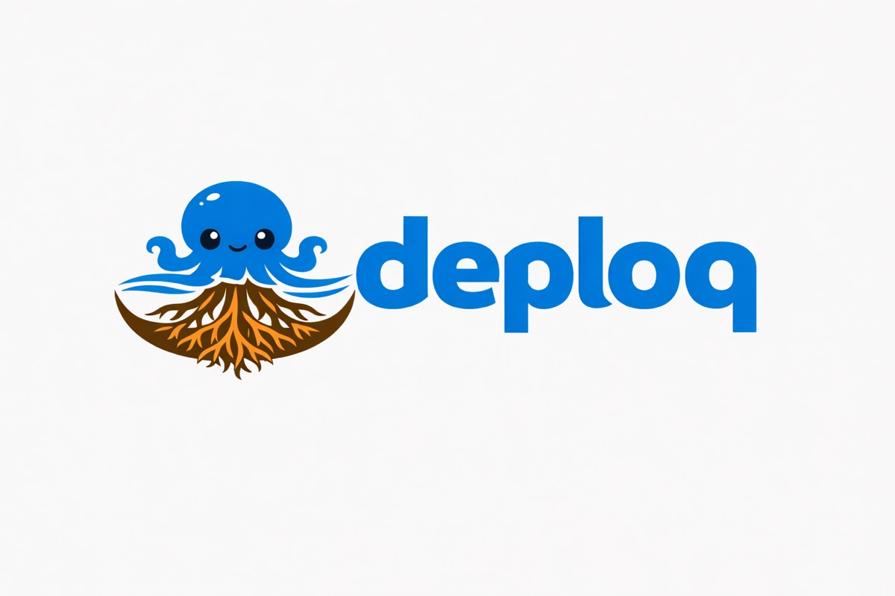

<p align="center">
  
</p>
<p align="center">轻量级 Docker Compose 项目 Webhook 部署工具。单一二进制文件，零依赖。</p>
<p align="center">
  <a href="https://github.com/us/deploq/releases"></a>
  <a href="https://github.com/us/deploq/actions"></a>
  <a href="LICENSE"></a>
  <a href="https://github.com/us/deploq/stargazers"></a>
</p>
<p align="center">
  <a href="#快速开始">快速开始</a> •
  <a href="docs/">文档</a> •
  <a href="CHANGELOG.md">更新日志</a> •
  <a href="README.md">English</a>
</p>

## 最新版本

### v0.0.3
- 事件类型过滤（`trigger: [push, release]`），支持 ping 事件
- 部署失败处理：`/status/{project}` 端点 + `on_failure` Shell 钩子
- CI 状态检查：部署前等待 GitHub CI 通过
- 输入验证和安全性改进

### v0.0.2
- 多平台二进制发布（linux/darwin, amd64/arm64）

[完整更新日志 →](CHANGELOG.md)

## 为什么选择 deploq？

大多数部署工具要么过于复杂（Kubernetes、Ansible），要么过于脆弱（纯 Shell 脚本）。deploq 恰好处于最佳位置：一个接收 Webhook 并运行 `docker compose up` 的单一二进制文件。无代理、无 YAML 模板引擎、无集群管理。

- **单一二进制** — 下载、配置、运行
- **配置驱动** — 支持环境变量插值的 YAML
- **默认安全** — HMAC-SHA256 验证、密钥验证、输入清理
- **生产就绪** — 优雅关闭、部署锁定、失败钩子

## 功能特性

- **GitHub 和通用 Webhook** — HMAC-SHA256 或基于 Token 的验证
- **事件过滤** — 按 `push`、`release` 或两者触发
- **CI 状态检查** — 部署前等待 GitHub CI 通过
- **失败钩子** — 部署失败时运行 Shell 命令（Slack、邮件等）
- **部署状态 API** — `/status/{project}` 返回最近部署结果
- **并发安全** — 每项目锁定、重复 SHA 检测
- **优雅关闭** — 带超时等待活跃部署完成

## 快速开始

```bash
# 安装
curl -L https://github.com/us/deploq/releases/latest/download/deploq-linux-amd64 -o deploq
chmod +x deploq && sudo mv deploq /usr/local/bin/

# 或通过 Go 安装
go install github.com/us/deploq/cmd/deploq@latest

# 生成配置并启动
deploq init
export DEPLOQ_SECRET_MY_APP="your-secret-here-min-16-chars"
deploq validate
deploq serve
```

## 配置

```yaml
listen: ":9090"

projects:
  backend:
    path: /home/deploy/backend
    branch: main
    secret: "${DEPLOQ_SECRET_BACKEND}"
    compose_file: docker-compose.prod.yml  # 默认: docker-compose.yml
    deploy_timeout: 15m                     # 默认: 15m
    trigger: [push, release]               # 默认: [push]
    on_failure: "curl -s -X POST ${SLACK_WEBHOOK} -d '{\"text\":\"部署失败: $DEPLOQ_PROJECT\"}'"
    require_status_checks: true            # 默认: false
    status_check_max_wait: 10m             # 默认: 5m
```

密钥使用 `${ENV_VAR}` 插值 — 绝不以明文存储。

使用 `require_status_checks` 时需设置 `DEPLOQ_GITHUB_TOKEN` 环境变量。

## API

| 端点 | 方法 | 说明 |
|------|------|------|
| `/webhook/{project}` | POST | 接收 Webhook，触发部署 |
| `/status/{project}` | GET | 最近部署结果（SHA、步骤、时间戳、错误） |
| `/health` | GET | 健康检查（`{"status":"ok"}`） |

## 部署流水线

```
收到 Webhook
  → 验证签名（GitHub 用 HMAC-SHA256，通用方式用 Token）
  → 检查事件类型过滤器（push/release/ping）
  → 检查分支过滤器（release 事件跳过）
  → 检查重复 SHA
  → 获取项目锁（非阻塞，忙时返回 409）
  → 等待 CI 状态检查（如已启用）
  → git fetch origin <branch>
  → git reset --hard origin/<branch>
  → docker compose build
  → docker compose up -d
  → 失败时：运行 on_failure 钩子（如已配置）
```

## Webhook 设置

### GitHub

1. 进入仓库 **Settings → Webhooks → Add webhook**
2. Payload URL：`https://deploy.example.com/webhook/my-app`
3. Content type：`application/json`
4. Secret：与 `DEPLOQ_SECRET_MY_APP` 相同
5. Events：选择 `push` 和/或 `Releases`（与 `trigger` 配置匹配）

### 通用 CI（GitHub Actions、GitLab 等）

```yaml
- run: |
    curl -X POST https://deploy.example.com/webhook/my-app \
      -H "X-Deploq-Token: ${{ secrets.DEPLOQ_TOKEN }}" \
      -H "Content-Type: application/json" \
      -d '{"ref":"${{ github.ref }}","sha":"${{ github.sha }}"}'
```

## CLI 命令

```
deploq serve              # 启动 Webhook 服务器
deploq deploy <project>   # 手动部署
deploq init               # 生成 deploq.yaml
deploq validate           # 验证配置
deploq version            # 打印版本
```

## 生产部署

<details>
<summary><strong>systemd</strong></summary>

```bash
sudo mkdir -p /etc/deploq

sudo tee /etc/deploq/deploq.yaml << 'EOF'
listen: ":9090"
projects:
  my-app:
    path: /home/deploy/my-app
    branch: main
    secret: "${DEPLOQ_SECRET_MY_APP}"
EOF

echo "DEPLOQ_SECRET_MY_APP=$(openssl rand -hex 20)" | sudo tee /etc/deploq/env
sudo chmod 600 /etc/deploq/env

sudo cp scripts/deploq.service /etc/systemd/system/
sudo systemctl enable --now deploq
```

</details>

<details>
<summary><strong>Caddy 反向代理</strong></summary>

```
deploy.example.com {
    reverse_proxy localhost:9090
}
```

</details>

## 文档

完整文档请访问 [docs/](docs/)。

## 贡献

欢迎 PR。提交前请运行 `gofmt`、`go vet` 和 `go test ./...`。

## 许可证

MIT
